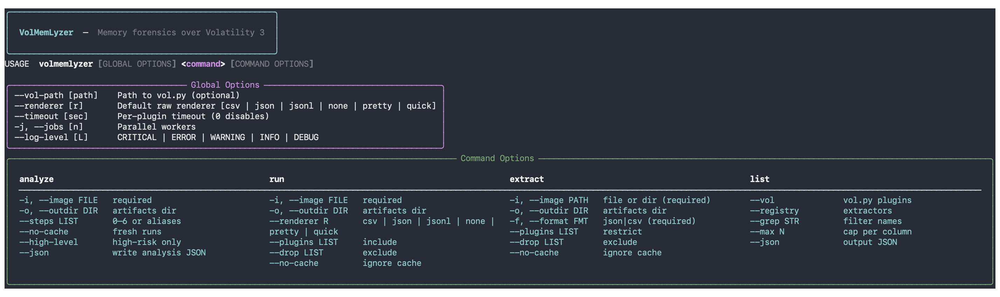

# VolMemLyzer

Volatility 3 CLI for parallel plugin runs, feature extraction, and stepwise DFIR triage.

[](LICENSE)
[](https://github.com/YaCnDehfuli/VolMemLyzer3-CLI_forensic_tool/actions/workflows/ci.yml)


[](https://github.com/YaCnDehfuli/VolMemLyzer3-CLI_forensic_tool/releases)

## Results

Extracting `10` plugins from a `4412228315`-byte Windows image takes `172.16`s serially and `71.12`s with `4` workers — a `2.4×` reduction in wall-clock. Median of 3 runs on `Intel(R) Core(TM) i7-1068NG7 CPU @ 2.30GHz, 8 logical cores, 17179869184 bytes RAM, macOS 26.6.2`. Full method and raw results in `benchmarks/`.



**Stable tool.** 72 extractor functions. Three workflows: `analyze`, `run`, and `extract`. Not an EDR.

## Quickstart

```bash
git clone https://github.com/YaCnDehfuli/VolMemLyzer3-CLI_forensic_tool.git
cd VolMemLyzer3-CLI_forensic_tool
python -m pip install -e .
volmemlyzer --help
volmemlyzer analyze -i /cases/host.vmem
volmemlyzer extract -i /cases/host.vmem -f json
```

The published wheel is `volmemlyzer==3.0.1` (`pip install volmemlyzer`). A clean checkout of this tree is the source of the measured figure above.

## Requirements

- Python 3.9 or later
- A supported Volatility 3 installation

VolMemLyzer resolves Volatility in this order: an explicit `--vol-path` or `VOL_PATH` value, the installed `volatility3` Python module, the `vol` command on `PATH`, and common local `vol.py` locations.

## CLI reference

Global options must appear before the subcommand:

```text
--vol-path PATH     Path to vol or vol.py; auto-detected when omitted
--renderer NAME     json, jsonl, csv, pretty, quick, or none
--timeout SECONDS   Per-plugin timeout, default 1800; 0 disables the cap
-j, --jobs N        Number of parallel workers, default half the CPU count
--log-level LEVEL   CRITICAL, ERROR, WARNING, INFO, or DEBUG
```

Plugins run against a dependency graph rather than in lockstep batches: each one
starts as soon as its own inputs are ready, so a long pool scan never holds up
work that does not depend on it. Raise `-j` to overlap more of them.

Plugin names are resolved against the Volatility you actually have installed, so
relocations such as `windows.malfind` moving to `windows.malware.malfind` are
handled without changes here. `volmemlyzer list --registry` prints the resolved
name for every extractor and flags anything your build does not provide.

The complete feature schema is documented in [FEATURES.md](FEATURES.md).

### `analyze`

Runs the DFIR overview for a single image.

```bash
volmemlyzer \
  --vol-path /opt/volatility3/vol.py \
  --renderer json \
  --timeout 600 \
  -j 4 \
  analyze \
  -i /cases/host.vmem \
  -o /cases/.volmemlyzer \
  --steps 0,1,2,3,4 \
  --json
```

Every plugin the requested steps need is collected in a single scheduled run
before any step interprets its output, so the steps overlap instead of queueing.

Use `--no-cache` to force fresh plugin runs. Supported step aliases include `bearings`, `processes`, `injections`, `network`, `persistence`, `kernel`, and `report`.

### Reading the risk column

Every step scores findings on one ladder — Low, Medium (9), High (14), Critical
(20) — and only tables a row once it reaches Medium. `--min-risk` raises that
floor (`--high-level` is the same thing as `--min-risk high`).

**These bands surface signal for review. They are not detections.** A Critical
row means several unusual things line up on one object, not that it is
malicious; plenty of legitimate software will land in the table, and a quiet
table is not a clean machine. Thresholds live in
`OverviewAnalysis.SURFACE_THRESHOLDS` and the path lists in
`utilities.SUSPICIOUS_DIRS` / `USER_INSTALL_SUBDIRS`, so tuning for your estate
is a data edit rather than a code change.

`--deep` adds the slow cross-check plugins to the process census. Today that is
`psxview`, which re-runs `psscan`, `thrdscan` and a csrss handle sweep internally
and will dominate the run on a large image; the census itself comes from
`pslist`, `pstree` and `psscan` without it.

### `run`

Runs raw Volatility plugins and stores their artifacts.

```bash
volmemlyzer \
  --renderer json \
  -j 4 \
  run \
  -i /cases/host.vmem \
  -o /cases/.volmemlyzer \
  --plugins pslist,pstree,psscan
```

Use either `--plugins` to include specific plugins or `--drop` to exclude plugins; do not combine them.

### `extract`

Runs the required plugins and writes ML-ready features.

```bash
volmemlyzer \
  -j 4 \
  extract \
  -i /cases \
  -o /cases/.volmemlyzer \
  -f csv \
  --drop netscan
```

For directory input, VolMemLyzer scans supported memory-image extensions recursively and writes one feature file per image under `<outdir>/features/`.

### `list`

Shows registered feature extractors, detected Volatility plugins, or both.

```bash
volmemlyzer list --registry
volmemlyzer list --vol --grep process
```

Run `volmemlyzer <command> --help` for the complete option list.

## Legacy compatibility command

`main.py` remains available for scripts written for earlier releases. It can process a file or directory and produce one aggregated feature file:

```bash
python main.py \
  -f /cases \
  -o /cases/output \
  -V /opt/volatility3/vol.py \
  -F csv
```

New integrations should use the packaged `volmemlyzer` command.

## Outputs and caching

- Raw plugin artifacts are written under the selected output directory.
- Extracted features are written under `<outdir>/features/`.
- Existing artifacts are reused unless `--no-cache` is supplied.
- JSON is the recommended renderer for downstream feature extraction.

## Troubleshooting

- If Volatility cannot be found, pass `--vol-path` or set `VOL_PATH`.
- If an artifact cannot be written, confirm that `--outdir` names a writable directory.
- Quote paths that contain spaces, especially on Windows.
- If a cached artifact cannot be converted to the requested format, VolMemLyzer reruns the plugin with the selected renderer.

## Limitations

The README figure is wall-clock of `volmemlyzer extract` on the pinned
plugin list in `benchmarks/plugins.yaml`, not the full registry and not an
end-to-end case. Byte-walk, dump, and pool-wide scanners are excluded;
`psscan` and `netscan` timed out on this image and are not in the list.
Serial and parallel runs disable the artifact cache; cache-warm
is reported separately. Different images, Volatility builds, worker counts, and
hosts will not reproduce the same seconds. Risk bands in `analyze` are review
signals, not detections. The tool does not monitor endpoints and is not an EDR.

## Citation

For background on VolMemLyzer V1 and V2, cite:

> A. H. Lashkari, B. Li, T. L. Carrier, and G. Kaur, “VolMemLyzer: Volatile Memory Analyzer for Malware Classification using Feature Engineering,” 2021 RDAAPS, pp. 1–8. DOI: [10.1109/RDAAPS48126.2021.9452028](https://doi.org/10.1109/RDAAPS48126.2021.9452028).

## Team

- [Arash Habibi Lashkari](http://ahlashkari.com/index.asp) — founder and project owner
- [Yasin Dehfouli](https://github.com/YaCnDehfuli) — V3 developer and maintainer
- [Abhay Pratap Singh](https://github.com/Abhay-Sengar) — V2 researcher and developer
- [Beiqi Li](https://github.com/beiqil) — V1 developer
- [Tristan Carrier](https://github.com/TristanCarrier) — V1 researcher and developer
- [Gurdip Kaur](https://www.linkedin.com/in/gurdip-kaur-738062164/) — researcher

## Acknowledgments

This project received support from the Natural Sciences and Engineering Research Council of Canada (NSERC), grant RGPIN-2020-04701 awarded to Arash Habibi Lashkari, and from the Mitacs Globalink Research Internship program.

## License

VolMemLyzer is free software licensed under the [GNU General Public License, version 3 or later](LICENSE). This license applies to the repository; Volatility and other dependencies remain subject to their own licenses.
