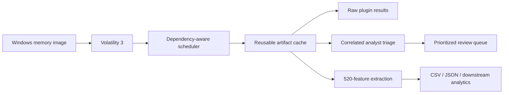
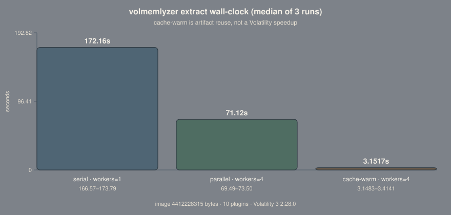

<div align="center">

# VolMemLyzer3

### Turn a Windows memory image into correlated forensic findings and ML-ready features — without manually coordinating dozens of Volatility plugins.

Built on **Volatility 3** for dependency-aware plugin execution, artifact reuse, forensic triage, and large-scale feature extraction.

[**Technical Report**](https://yacndehfuli.github.io/VolMemLyzer3-CLI_forensic_tool/) ·
[**Analysis Rules**](https://yacndehfuli.github.io/VolMemLyzer3-CLI_forensic_tool/#rules) ·
[**Feature Explorer**](https://yacndehfuli.github.io/VolMemLyzer3-CLI_forensic_tool/features.html) ·
[**Benchmarks**](benchmarks/) ·
[**Examples**](examples/) ·
[**Releases**](https://github.com/YaCnDehfuli/VolMemLyzer3-CLI_forensic_tool/releases)

[](https://github.com/YaCnDehfuli/VolMemLyzer3-CLI_forensic_tool/actions/workflows/ci.yml)


[](LICENSE)

</div>

---

## What this project does

Volatility exposes powerful memory-forensics plugins, but a real investigation still has to coordinate them:

- some plugins are expensive;
- some depend on context produced by others;
- outputs are stored separately and must be correlated manually;
- repeated analysis can rerun work that has already been completed; and
- machine-learning or statistical pipelines need structured image-level measurements rather than raw plugin tables.

**VolMemLyzer is the orchestration and analysis layer around Volatility 3.**

It runs the required plugins, respects their dependencies, reuses completed artifacts, correlates evidence across plugin outputs, and can turn the same case into a **520-feature image-level representation** for downstream analysis.

| Capability | What it provides |
|---|---|
| **Dependency-aware execution** | Independent plugins run concurrently; a dependent starts as soon as its own prerequisites finish. |
| **Artifact reuse** | Cached Volatility results are reused or converted instead of blindly rerunning the memory image. |
| **Correlated forensic triage** | Process, private-memory, network, persistence, execution-history, and kernel evidence are scored together. |
| **Feature extraction** | **520 features across 51 groups** for statistics and ML workflows. |

VolMemLyzer does **not** replace Volatility. Volatility remains the forensic engine; VolMemLyzer manages how its outputs are collected, reused, correlated, and consumed.

## Architecture



A slow plugin blocks only the work that actually depends on it. The scheduler releases downstream work as soon as its prerequisites complete instead of waiting for an unrelated batch to finish.

[**See the execution model →**](https://yacndehfuli.github.io/VolMemLyzer3-CLI_forensic_tool/#scheduler)

## Measured execution

On the committed benchmark, extracting the same 10-plugin set from a 4.41 GB Windows memory image produced:

| Configuration | Workers | Cache | Median wall-clock |
|---|---:|---|---:|
| Serial | 1 | off | **172.16 s** |
| Parallel | 4 | off | **71.12 s** |
| Cache warm | 4 | on | **3.1517 s** |

Parallel execution reduces measured wall-clock by **2.4×** on this workload.

The warm-cache result measures **artifact reuse**, not faster Volatility execution.

<p align="center">
  
</p>

[**Benchmark method and raw results →**](benchmarks/)

## What analysis looks like

The analysis workflow turns separate forensic observations into a review queue with explicit evidence.

In the current example analysis:

- **118 processes** are present in the census;
- **31 indicators** are surfaced;
- the posture contains **3 Critical, 1 High, 6 Medium, and 21 Low** review items;
- the highest-priority `malware.exe` process reaches **23.6/30** with **94.6%** confidence from independent private-memory, credential-access, loader-walk, and privilege evidence.

The important part is not the label. Each object carries the signals that fired and explains why it moved up the queue.

[**Open the analysis report →**](https://yacndehfuli.github.io/VolMemLyzer3-CLI_forensic_tool/#validation)  
[**Search the exact rule conditions →**](https://yacndehfuli.github.io/VolMemLyzer3-CLI_forensic_tool/#rules)  
[**Read the canonical rule specification →**](docs/ANALYSIS_RULES.md)

## Three workflows

### Analyze — prioritize what deserves review

```bash
volmemlyzer -j 4 analyze \
  -i /cases/host.vmem \
  -o /cases/.volmemlyzer \
  --deep
```

The analyst-facing layer spans six surfaces:

- process census and lineage;
- executable private memory;
- network state;
- persistence and execution history;
- kernel dispatch integrity; and
- image/context bearings.

Related observations are correlated into evidence families so repeated symptoms of one hypothesis do not artificially inflate a score.

### Run — execute and retain Volatility artifacts

```bash
volmemlyzer -j 4 run \
  -i /cases/host.vmem \
  -o /cases/.volmemlyzer \
  --plugins pslist,pstree,psscan
```

Results are retained for later analysis and extraction.

VolMemLyzer also resolves configured plugin names against the Volatility installation actually present, which helps when plugins move between namespaces across Volatility releases.

### Extract — build a reusable feature vector

```bash
volmemlyzer -j 4 extract \
  -i /cases/host.vmem \
  -o /cases/.volmemlyzer \
  -f csv
```

The extraction layer currently exposes:

**520 features · 51 groups · 72 extractor functions · 56 registered plugin definitions**

The schema covers processes, registry, networking, VADs, modules, services, handles, privileges, kernel structures, persistence artifacts, and other memory-derived measurements.

[**Open the interactive Feature Explorer →**](https://yacndehfuli.github.io/VolMemLyzer3-CLI_forensic_tool/features.html)  
[**Read the canonical feature schema →**](FEATURES.md)

## Artifact reuse

Every successful plugin result becomes a reusable artifact.

When a later workflow needs the same evidence, VolMemLyzer can:

1. use an exact cached result;
2. convert a compatible cached artifact into the required format; or
3. rerun Volatility only when no usable artifact exists.

A failed or zero-byte artifact is recorded as **unavailable**. It is never silently interpreted as a clean result.

## Evidence prioritization, not malware classification

VolMemLyzer's analysis score is a bounded ordinal evidence value.

```text
0–8    Low
9–13   Medium
14–19  High
20–30  Critical
```

The engine retains the strongest observation from each correlated hypothesis family, sums independent evidence, and caps the result at 30.

A high score means several review-worthy observations align on the same object.

It does **not** mean:

- malware probability;
- model confidence;
- confirmed ATT&CK activity; or
- proof that an intrusion occurred.

## Quick start

```bash
git clone https://github.com/YaCnDehfuli/VolMemLyzer3-CLI_forensic_tool.git
cd VolMemLyzer3-CLI_forensic_tool

python -m venv .venv
source .venv/bin/activate

python -m pip install -e .

volmemlyzer --help
volmemlyzer analyze -i /cases/host.vmem
```

Requirements:

- Python 3.9+
- Volatility 3
- a memory image supported by the installed Volatility build

## CLI

<p align="center">
  
</p>

The CLI provides `analyze`, `run`, `extract`, and `list` workflows. Python API examples are available in [`examples/`](examples/).

## Used by MemTriage

[MemTriage](https://github.com/YaCnDehfuli/MemTriage) consumes VolMemLyzer's memory-forensics extraction and artifact layer.

That separation is intentional: MemTriage can focus on the analyst workspace while linking directly back here for plugin execution, caching, rule logic, or feature-schema details.

## Documentation

| Resource | Purpose |
|---|---|
| [Technical report](https://yacndehfuli.github.io/VolMemLyzer3-CLI_forensic_tool/) | Architecture, scheduler, artifact reuse, performance, analysis, rules, and observed triage output |
| [Analysis rule explorer](https://yacndehfuli.github.io/VolMemLyzer3-CLI_forensic_tool/#rules) | Search the analyst-facing rule conditions |
| [Exact rule specification](docs/ANALYSIS_RULES.md) | Inputs, predicates, weights, evidence families, ATT&CK alignment, and controls |
| [Feature explorer](https://yacndehfuli.github.io/VolMemLyzer3-CLI_forensic_tool/features.html) | Interactive view of the 520-feature schema |
| [Feature schema](FEATURES.md) | Canonical feature definitions |
| [Benchmarks](benchmarks/) | Method, environment, plugin set, and raw measurements |
| [Examples](examples/) | CLI and Python API examples |
| [Changelog](CHANGELOG.md) | Release history |

## Scope

VolMemLyzer is a memory-forensics orchestration, analysis, and extraction framework.

It is **not** an EDR, antivirus, live endpoint monitor, or malware classifier.

Analysis scores prioritize evidence for human review. Different images, Volatility versions, plugin populations, worker counts, and systems will produce different forensic and performance results.

## Citation

For the original VolMemLyzer research lineage:

> A. H. Lashkari, B. Li, T. L. Carrier, and G. Kaur,  
> “VolMemLyzer: Volatile Memory Analyzer for Malware Classification using Feature Engineering,”  
> 2021 RDAAPS, pp. 1–8.  
> DOI: https://doi.org/10.1109/RDAAPS48126.2021.9452028

## Team

- **Arash Habibi Lashkari** — founder and project owner
- **Yasin Dehfouli** — VolMemLyzer3 developer and maintainer
- **Abhay Pratap Singh** — VolMemLyzer2 researcher and developer
- **Beiqi Li** — VolMemLyzer1 developer
- **Tristan Carrier** — VolMemLyzer1 researcher and developer
- **Gurdip Kaur** — researcher

## License

VolMemLyzer is licensed under the [GNU General Public License v3 or later](LICENSE).

Volatility and other dependencies retain their own licenses.
