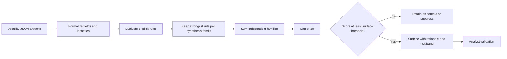
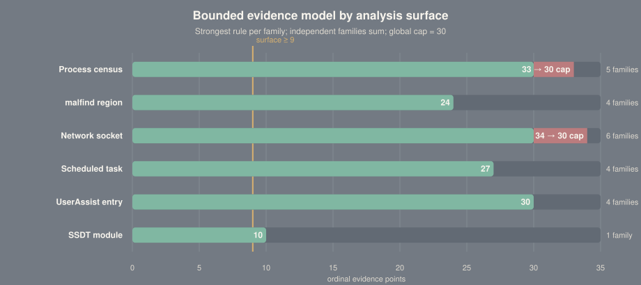
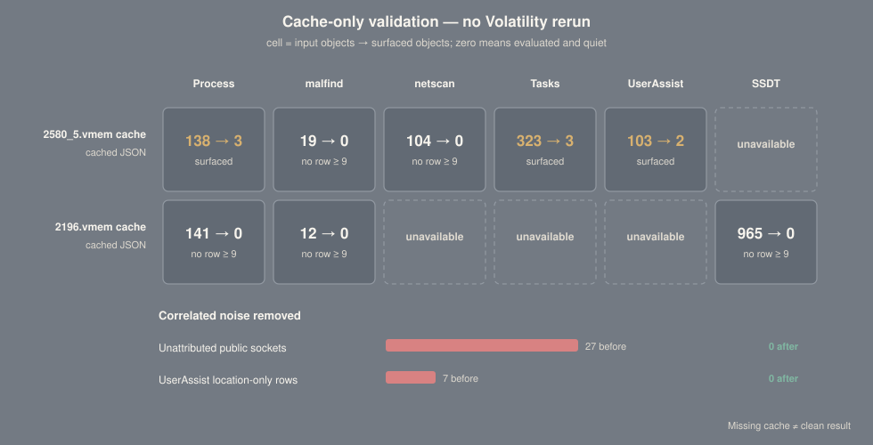

# VolMemLyzer analysis rules and validation

## Purpose and claim boundary

VolMemLyzer does not classify a process as malware and does not claim to detect
an intrusion. Its `analyze` workflow surfaces memory-forensics artifacts that
satisfy explicit investigative hypotheses. The output is a prioritized review
queue: a finding explains *why an analyst should inspect an object*, not what an
adversary definitively did.

The score is a bounded ordinal evidence value:

- it is not a probability;
- it is not a confidence percentage;
- it is not comparable to a model posterior or antivirus verdict;
- a quiet result does not establish that an image is clean; and
- an ATT&CK reference describes a compatible hypothesis, not confirmed
  adversary behavior.

This document is the specification for the rule logic in
[`src/volmemlyzer/analysis.py`](../src/volmemlyzer/analysis.py). It records the
input fields, exact matching logic, evidence weights, correlation controls,
ATT&CK alignment, and cache-only validation used to justify each surfaced row.

> **Interpretation rule:** “Direct” ATT&CK alignment means the artifact contains
> the mechanism described by the technique. It still does not establish
> adversary intent. “Supporting” means the artifact is compatible with the
> technique but has credible benign or forensic alternatives. “Omit” means the
> code deliberately makes no ATT&CK claim.

## Analysis pipeline



Correlated observations do not add repeatedly. For example, `malfind` can
identify a PEB access pattern, a loader-list walk, and hash-like immediates in
the same 64-byte prefix. All three test the loader-behavior hypothesis, so only
the strongest contributes. Likewise, a process cannot accumulate multiple
lineage scores for the same parent-child relationship.

<p align="center">
  
</p>
<sub>The bar is a theoretical family total, not a target. Process and network
totals can exceed 30 before the global cap; some network conditions are also
mutually exclusive because a socket cannot be listening and established at the
same time.</sub>

## Shared score ladder

The shared score ladder is intentionally small and ordinal:

| Score | Band | Meaning |
|---:|---|---|
| 0–8 | Low | Context or a single weak/ambiguous observation; not surfaced by default |
| 9–13 | Medium | One major observation or corroborating weaker observations |
| 14–19 | High | Multiple independent observations align on the same object |
| 20–30 | Critical | Several strong, independent hypotheses align; still not a verdict |

The default surface threshold is **9** for every scored source:

```python
SURFACE_THRESHOLDS = {
    "process": 9,
    "malfind": 9,
    "netscan": 9,
    "scheduled_tasks": 9,
    "userassist": 9,
    "ssdt": 9,
}
```

`--min-risk medium`, `high`, or `critical` raises the effective threshold to 9,
14, or 20. `--high-level` is equivalent to `--min-risk high`. A surface-specific
threshold is never below a band boundary.

The aggregation equation is:

```text
object score = min(30, Σ strongest_weight[hypothesis_family])
```

Ties retain the first rule evaluated in that family. This affects the displayed
flag/rationale, not the numerical score.

## Quick and deep collection boundaries

| Step | Surface | Quick artifacts | Additional `--deep` artifacts |
|---:|---|---|---|
| 0 | Bearings | `windows.info` | — |
| 1 | Process census | `pslist`, `pstree` | `psscan`, `psxview` |
| 2 | Executable private memory | `malfind` | — |
| 3 | Network | skipped | `netscan` |
| 4 | Persistence and execution history | `registry.hivelist`, `scheduled_tasks`, `registry.userassist` | `registry.hivescan` |
| 5 | Kernel dispatch integrity | skipped | `ssdt` |

`psscan`, `netscan`, and `registry.hivescan` pool-scan memory. `psxview` invokes
`psscan`, `thrdscan`, and a CSRSS handle sweep. They stay behind `--deep` because
they can dominate runtime. `ssdt` is also deep-only because it is a specialized
kernel-integrity view with a different validation burden, not because it is a
byte scanner.

Requested plugins are submitted to the dependency scheduler in one batch and
can execute concurrently. A failed or empty artifact is *unavailable*; it is
never interpreted as a clean result.

---

## Rule catalog

### 1. Process census

#### Input and normalization

The process census combines:

- `pslist`: `PID`, `PPID`, `ImageFileName`, `Wow64`, creation/exit metadata;
- recursively flattened `pstree`: `PID`, `PPID`, `ImageFileName`, `Path`, `Cmd`;
- deep `psscan`: `PID`, `ExitTime`; and
- deep `psxview`: `PID`, `pslist`, `psscan`, `thrdscan`, `csrss`.

`Path` is preferred; `Cmd` is used only when the path is absent. PID 0 is the
kernel root and is not counted as a missing parent. One output row is permitted
per PID.

#### Discovery family

| Flag | Exact condition | Weight | Investigative hypothesis | ATT&CK |
|---|---|---:|---|---|
| `HK` | PID is present in `psscan`, absent from `pslist`, and `ExitTime` is empty or `N/A` | 10 | A live EPROCESS may be unlinked or concealed | [T1564 Hide Artifacts](https://attack.mitre.org/techniques/T1564/) — supporting |
| `TERM` | PID is present only in `psscan`, but has a non-empty exit time | 2 | Stale allocation from ordinary process termination | Omit |
| `XV` | At least two of the exact boolean fields `pslist`, `psscan`, `thrdscan`, `csrss` are `False` | 8 | Independent discovery mechanisms disagree | T1564 — supporting |

One false `psxview` source is ignored because exited or transitional processes
commonly disappear from a single view. String values such as `"False"` are not
accepted as boolean evidence. `HK`, `TERM`, and `XV` share the `discovery`
family; only the strongest contributes.

#### Lineage family

| Flag | Exact condition | Weight | Investigative hypothesis | ATT&CK |
|---|---|---:|---|---|
| `ZB` | `PPID` is neither null nor 0 and is absent from the census | 4 | Parent exited, is missing, or acquisition is incomplete | Omit |
| `WP` | Parent is in the constrained system-parent map and the child name is outside the expected set | 4 | A protected Windows lineage is unusual | Omit |
| `SCRIPT_CHILD_EXTERNAL` | Parent is an exact script-interpreter name; child path matches external drive/UNC logic; child extension is `.exe`, `.com`, or `.scr` | 6 | An interpreter launched a native payload from a non-system volume/share | Interpreter-specific T1059 — supporting |

The script-parent set is exactly:

```text
powershell.exe, pwsh.exe, cmd.exe, wscript.exe, cscript.exe, mshta.exe
```

The external-path test is:

```regex
^[d-z]:\
```

after lower-casing, or a path beginning with `\\`. The child basename must end
in `.exe`, `.com`, or `.scr`. A normal child under `C:\Windows` or
`C:\Program Files` does not satisfy this rule.

The constrained expected-child map is:

| Parent | Expected child names |
|---|---|
| `smss.exe` | `csrss.exe`, `wininit.exe`, `winlogon.exe`, `smss.exe` |
| `wininit.exe` | `services.exe`, `lsass.exe`, `lsm.exe`, `fontdrvhost.exe` |
| `winlogon.exe` | `userinit.exe`, `dwm.exe`, `fontdrvhost.exe`, `logonui.exe` |
| `lsass.exe` | no expected children |

The map is deliberately narrow. Broad parent-child allowlists age poorly across
Windows releases and create false confidence.

#### Location and context families

| Flag | Exact condition | Family | Weight | ATT&CK |
|---|---|---|---:|---|
| `OP` | `is_suspicious_path(path)`, or `not_system_path(path)` and not `in_user_install_dir(path)` | `location` | 7 | Omit; path is context |
| `USERINSTALL` | Non-system path recognized as a conventional per-user install directory | `location` | 2 | Omit |
| `WOW` | `OP` is present and `Wow64` parses true | `context` | 2 | Omit |

The concrete Windows path predicates are maintained in
[`src/volmemlyzer/utilities.py`](../src/volmemlyzer/utilities.py). Environment
variables such as `%windir%` are resolved according to Windows semantics rather
than the host running VolMemLyzer.

#### Identity family

| Flag | Exact condition | Weight | ATT&CK |
|---|---|---:|---|
| `IMP` | Exact protected system-binary name with a non-system path | 8 | [T1036.005 Match Legitimate Resource Name or Location](https://attack.mitre.org/techniques/T1036/005/) — direct hypothesis |
| `LOOK` | Name is one edit from a protected system-binary name | 8 | T1036.005 — direct hypothesis |
| `UNI` | Process name contains a non-ASCII character | 4 with `OP`, otherwise 2 | Omit unless a specific deceptive Unicode control is established |

Protected names:

```text
svchost.exe, services.exe, lsass.exe, csrss.exe, smss.exe,
wininit.exe, winlogon.exe, explorer.exe, spoolsv.exe, conhost.exe,
taskhostw.exe, dllhost.exe, rundll32.exe, dwm.exe, userinit.exe,
lsm.exe, searchindexer.exe, runtimebroker.exe, sihost.exe
```

The one-edit algorithm recognizes exactly one insertion, deletion, or
substitution, plus one adjacent transposition. Exact matches are excluded.
Examples include `svch0st.exe`, `lsasss.exe`, and `scvhost.exe`.

#### Process example from cache

In the cache labeled `2580_5.vmem`, the actual process identifiers in the JSON
show:

```text
powershell.exe PID 5048
  └─ malware.exe PID 7936, Path Z:\malware.exe, Wow64=True
```

PID 7936 receives:

| Family | Evidence | Weight |
|---|---|---:|
| location | `OP`: non-system path `Z:\malware.exe` | 7 |
| lineage | `SCRIPT_CHILD_EXTERNAL`: PowerShell parent plus external native child | 6 |
| context | `WOW`: 32-bit process from that path | 2 |
| **Total** | **High** | **15/30** |

The child is present in `pslist`, `psscan`, and `psxview`, which supports the
integrity of the observation but does not add “agreement points.” Rewarding
normal agreement would inflate scores without adding suspicious evidence.

The filename `2580_5.vmem` does **not** contain PID 2580 in the supplied cached
process artifacts; its observed payload process is PID 7936. The report uses
observed PIDs rather than converting a filename hint into evidence.

---

### 2. Executable private memory (`malfind`)

#### Input and scope

Each row uses:

- `Protection`;
- `PrivateMemory`;
- `CommitCharge`; and
- the first 64 bytes rendered in `Hexdump`.

Scoring never depends on the optional `Disasm` renderer. This avoids changing
results depending on whether Capstone is installed. Missing, `N/A`, malformed,
or non-string hexdumps become empty bytes. A non-empty 64-byte prefix containing
only zero bytes is forced to score 0 even when its VAD permissions look unusual.

Duplicate rows are keyed by `(PID, Start VPN)` and never added together. The
strongest duplicate is kept.

#### Memory-shape family

| Flag | Exact condition | Weight | ATT&CK |
|---|---|---:|---|
| `RWX` | `Protection` contains both `EXECUTE` and `WRITE`; `PrivateMemory` parses true | 8 | [T1055 Process Injection](https://attack.mitre.org/techniques/T1055/) or [T1620 Reflective Code Loading](https://attack.mitre.org/techniques/T1620/) — supporting alternatives |
| `PRV` | Private and executable, but not writable | 4 | T1055/T1620 — supporting |

`WRITE` intentionally includes `WRITECOPY`. Raw RWX/private shape remains below
the 9-point surface threshold.

#### Payload family

| Flag | Exact test | Weight | ATT&CK |
|---|---|---:|---|
| `PE` | First two bytes are ASCII `MZ` | 8 | [T1055.002 Portable Executable Injection](https://attack.mitre.org/techniques/T1055/002/) or T1620 — supporting |
| `SLED` | Eight or more consecutive `0x90` bytes | 6 | T1055/T1620 — supporting |
| `STUB` | One exact shellcode-prologue regex matches | 8 | T1055/T1620 — supporting |

Exact NOP-sled expression:

```python
rb"\x90{8,}"
```

Exact prologue expressions:

```python
rb"\xfc\xe8[\x00-\xff]{2}\x00\x00"
rb"\xfc\x48\x83\xe4\xf0\xe8"
rb"\xe8\x00\x00\x00\x00[\x58-\x5f]"
```

They represent, respectively, a stager-like `cld/call` prefix, an x64 stack
alignment/call prefix, and `call $+5; pop register` position-independent code.

#### Loader-behavior family

| Flag | Exact test | Weight | ATT&CK |
|---|---|---:|---|
| `PEB` | Any direct PEB/TEB access pattern matches | 4 | [T1027.007 Dynamic API Resolution](https://attack.mitre.org/techniques/T1027/007/) — supporting |
| `LDRWALK` | At least two distinct loader-walk byte strings occur | 6 | T1027.007 — supporting |
| `APIHASH` | At least two qualifying `push imm32` candidates occur | 6 | T1027.007 — supporting |
| `SEG` | One segment-register manipulation regex matches | 4 | Omit |

PEB/TEB patterns:

```python
rb"\x64\xa1\x30\x00\x00\x00"
rb"\x64\x8b[\x00-\xff]\x30\x00\x00\x00"
rb"\x65\x48\x8b[\x00-\xff]\x25\x60\x00\x00\x00"
```

Loader-list operation byte strings:

```python
b"\x8b\x40\x0c"
b"\x8b\x70\x1c"
b"\x8b\x46\x08"
b"\x8b\x7e\x20"
b"\x8b\x36"
b"\x8b\x5e\x08"
b"\x8b\x4e\x20"
```

At least two different strings must occur. One generic structure-field access
is not sufficient.

API-hash candidate expression:

```python
re.finditer(rb"\x68(....)", data, re.DOTALL)
```

The four-byte immediate counts only when it contains at least three distinct
byte values and no more than one zero byte. At least two candidates must be
present in the 64-byte window.

Segment expressions:

```python
rb"\x0f\xa0.{0,4}\x1f"
rb"\x0f\xa8.{0,4}\x1f"
```

#### Size context

| Flag | Exact condition | Weight | ATT&CK |
|---|---|---:|---|
| `BIGCOMMIT` | `CommitCharge > 32` | 2 | Omit |

#### Validation behavior

The completed `2580_5.vmem` cache contains 19 raw `malfind` rows. All 19 are
private RWX regions scoring 8/30 and remain below threshold.

The rows include PowerShell, SearchHost, Python, and Outlook memory. This is the
negative control that prevents “RWX equals malware.”

The repository also preserves a 64-byte test vector documented as the PID 2580
`malware.exe` region. It contains RWX/private shape and multiple PEB loader-list
operations, producing **14/30 High** (`RWX` 8 + `LDRWALK` 6). JIT trampoline,
ordinary x64 prologue, relative-thunk, pointer-table, zero-filled, and
protection-only controls remain below 9.

---

### 3. Network (`netscan`, deep only)

#### Normalization and deduplication

Endpoints accept plain IPv4/IPv6, bracketed IPv6, scoped IPv6, and IPv4 with an
embedded port. Public addressing uses Python `ipaddress.is_global`; private,
loopback, multicast, documentation, and otherwise non-global addresses are not
treated as public.

These socket states are excluded before volume counting and scoring:

```text
CLOSED, CLOSE_WAIT, TIME_WAIT, FIN_WAIT1, FIN_WAIT2, LAST_ACK
```

The primary identity is:

```text
(PID, lower(owner), local address, local port,
 foreign address, foreign port, protocol, state)
```

#### Listener family

| Flag | Exact condition | Weight | ATT&CK |
|---|---|---:|---|
| `UnexpectedListener` | TCP `LISTEN`/`LISTENING`, local port 3389/445/139, owner not in system-owner set | 8 | Omit without protocol/application evidence |
| `HighPortListener` | TCP listener, local port ≥49152, named non-system owner, non-loopback local IP | 6 | [T1571 Non-Standard Port](https://attack.mitre.org/techniques/T1571/) — supporting |
| `UDPAnyHighPort` | UDP wildcard bind on `0.0.0.0`/`::`, local port ≥49152, named non-system owner | 4 | T1571 — supporting |

System owners are exactly:

```text
system, services.exe, lsass.exe, wininit.exe, svchost.exe, spoolsv.exe
```

UDP ports 5353, 5355, 1900, and 123 owned by `svchost.exe` or `system` are
explicitly de-noised.

#### Attribution family

| Flag | Exact condition | Weight | ATT&CK |
|---|---|---:|---|
| `PublicNoPID` | Established TCP connection to a global IP; PID null, empty, or 0 | 3 | Omit |

Missing process attribution is now an evidence-quality warning, not a major
signal. It cannot surface an otherwise ordinary public connection and cannot
unlock volume or established-public points.

#### Remote-service family

| Flag | Exact condition | Weight | ATT&CK |
|---|---|---:|---|
| `AdminPortOutbound` | `ESTABLISHED`/`SYN_SENT` to global destination port 3389, 445, or 23 | 8 | 3389 supports [T1021.001 RDP](https://attack.mitre.org/techniques/T1021/001/); 445 supports [T1021.002 SMB/Admin Shares](https://attack.mitre.org/techniques/T1021/002/); port 23 omitted |
| `BadPort` | Global destination port is 4444, 1337, 6969, 2222, 9001, 6667, or 6666 | 7 | T1571 — supporting |
| `UncommonPort` | Global, nonzero destination port outside both exact common and “demonstration” sets | 3 | T1571 — supporting |

Common-port de-noising set:

```text
80, 443, 53, 123, 25, 110, 995, 143, 993, 3389, 445, 139,
22, 21, 23, 587, 465, 389, 636, 135, 137, 138, 3306, 1433,
1521, 5432, 27017, 8080, 8443
```

Ports are investigative hints; the analyzer does not parse the application
protocol and does not call a socket command-and-control traffic.

#### Process-behavior family

| Flag | Exact condition | Weight | ATT&CK |
|---|---|---:|---|
| `LOLBINOutbound` | Established/SYN-sent global connection owned by an exact listed client | 8 | Utility-specific, supporting only |

Listed clients:

```text
powershell.exe, cmd.exe, wscript.exe, cscript.exe,
mshta.exe, rundll32.exe, regsvr32.exe
```

Potential alignment depends on the exact process: PowerShell T1059.001,
`cmd.exe` T1059.003, `mshta.exe` T1218.005, `rundll32.exe` T1218.011, or
`regsvr32.exe` T1218.010. Socket ownership alone does not prove abuse.

#### Context and volume families

| Flag | Exact condition | Weight | Constraint |
|---|---|---:|---|
| `EstablishedPublic` | Established global connection | 2 | Only after listener, remote-service, or process-behavior evidence |
| `LoopbackPair` | Both IPs loopback; both ports nonzero and outside common set | 2 | Context only |
| `ManyConns` | Process has ≥15 active unique sockets | 3 | Only after behavioral evidence |
| `ConnBurst` | Process has ≥50 active unique sockets | 4 | Only after behavioral evidence |
| `ToSameRemote` | ≥8 active sockets to the same global destination IP | 5 | Only after behavioral evidence |

These have no standalone ATT&CK mapping. Browsers, update agents, servers, and
CDNs routinely produce high connection counts.

#### Cache result

Before correlation control, 27 unattributed established public sockets crossed
the surface threshold. The destinations were dominated by ordinary Microsoft,
Akamai, and other public services, and every row lacked attribution. After
`PublicNoPID` was reduced to context and forbidden from corroborating itself,
**0 of 104 cached `netscan` rows surface**. A PID-less connection to public SMB
or RDP can still surface because the destination service is independent
evidence.

---

### 4. Scheduled tasks

#### Input

Fields:

```text
Task Name, Action, Action Arguments, Trigger Type,
Principal ID (or Author), Enabled
```

Windows `ntpath` semantics extract the action basename, then remove its optional
extension. The resulting action stem is compared exactly with the stems of:

```text
powershell.exe, pwsh.exe, cmd.exe, wscript.exe, cscript.exe, mshta.exe,
rundll32.exe, regsvr32.exe, msbuild.exe, wmic.exe, bitsadmin.exe, schtasks.exe
```

Every task artifact is structurally aligned with
[T1053.005 Scheduled Task](https://attack.mitre.org/techniques/T1053/005/).
That alignment describes the persistence/execution mechanism, not malicious
intent.

#### Argument-pattern payload family

Patterns are applied to lower-cased `Action Arguments`. Only the strongest
matched payload observation contributes.

| Flag | Exact regular expression | Weight | Interpretation | ATT&CK |
|---|---|---:|---|---|
| `ENCODED` | `(?:^|\s)-(?:enc|encodedcommand)(?:\s|$)` | 10 | Encoded command option | [T1027.010 Command Obfuscation](https://attack.mitre.org/techniques/T1027/010/) — direct mechanism |
| `DECODE` | `\bfrombase64string\b` | 9 | Base64 decoding primitive | [T1140 Deobfuscate/Decode](https://attack.mitre.org/techniques/T1140/) — direct mechanism |
| `IEX` | `(?:^|\s)iex(?:\s|\()` | 8 | PowerShell Invoke-Expression alias | [T1059.001 PowerShell](https://attack.mitre.org/techniques/T1059/001/) when action context is PowerShell |
| `NOPROFILE` | `(?:^|\s)-(?:nop|noprofile)(?:\s|$)` | 2 | Profile loading disabled | T1059.001 only; not “obfuscation” |
| `HIDDEN` | `(?:^|\s)-(?:w|windowstyle)\s+hidden(?:\s|$)` | 4 | Hidden PowerShell window | [T1564.003 Hidden Window](https://attack.mitre.org/techniques/T1564/003/) — direct mechanism |
| `POLICY_BYPASS` | `(?:^|\s)-(?:executionpolicy|ep)\s+bypass(?:\s|$)` | 4 | PowerShell policy-bypass option | T1059.001 only; no separate ATT&CK bypass claim |
| `BITS_TRANSFER` | See the two exact forms below | 9 | BITS transfer command | [T1197 BITS Jobs](https://attack.mitre.org/techniques/T1197/) — direct mechanism |
| `REMOTE` | literal `http://` or `https://` in arguments | 9 | Remote resource reference | [T1105 Ingress Tool Transfer](https://attack.mitre.org/techniques/T1105/) — supporting, not proof of transfer |
| `SCRIPT` | `\.(?:ps1|vbs|js|jse|wsf|hta|bat|cmd|psm1)(?:['"]?\s|$)` | 6 | Script path in arguments | Extension/interpreter-specific T1059 — supporting/direct only with execution context |

The old umbrella description “obfuscated or policy-bypassing arguments” was
removed because it incorrectly merged encoded commands, decoding, hidden
windows, BITS transfer, `IEX`, and ordinary `-NoProfile` use into one semantic
claim.

`BITS_TRANSFER` accepts either representation produced by task renderers:

1. the exact action stem is `bitsadmin` and arguments match
   `(?:^|\s)/transfer(?:\s|$)`; or
2. a wrapper action's arguments match
   `\bbitsadmin(?:\.exe)?\s+/transfer(?:\s|$)`.

A bare `bitsadmin.exe /list` invocation does not satisfy the transfer rule.

#### Location family

The combined action and arguments are considered path-like when they satisfy:

```regex
^[a-z]:\
```

or begin with `\\`, or contain a slash/backslash plus:

```regex
\.(exe|dll|sys|cpl|bat|cmd|ps1|psm1|vbs|js|hta|msi|scr|com)\b
```

| Flag | Condition | Weight |
|---|---|---:|
| `USERPATH` | Path-like, non-system, and not a conventional per-user vendor install | 8 |
| `USERINSTALL` | Conventional per-user install directory | 1 |

#### Execution family

| Flag | Condition | Weight | ATT&CK |
|---|---|---:|---|
| `LOLBIN` | Listed action plus an argument-pattern match or URL | 6 | Utility-specific, direct/supporting by arguments |
| `LOLBIN` | Listed action without suspicious content | 1 | Omit |
| `RUNDLL32` | `rundll32.exe` plus `.dll` reference | 3 | [T1218.011 Rundll32](https://attack.mitre.org/techniques/T1218/011/) — direct mechanism |
| `REGSVR32` | `regsvr32.exe` plus `.dll` argument | 3 | [T1218.010 Regsvr32](https://attack.mitre.org/techniques/T1218/010/) — direct mechanism |

#### Context family

One point per present item, capped at 3:

- action/arguments contain `\appdata\`, `\temp\`, `\users\public\`,
  `\downloads\`, or `\desktop\`;
- trigger contains `logon`, `startup`, or `boot`; and
- principal contains `system`, `administrator`, `adm`, `local service`, or
  `network service`.

If a task name starts `\microsoft\windows\`, the action references System32,
and no ≥8-point argument pattern, script, remote URL, or non-system payload is
present, its score is capped at 4. A disabled task is annotated but is not given
negative risk points.

#### Cache result

Exactly three of 323 cached tasks surface, each **16/30 High**:

| Task | Action | Script | Trigger | Score basis |
|---|---|---|---|---|
| `LOG` | PowerShell | `C:\Workspace\export_logs.ps1` | Logon | script 6 + user path 8 + LOLBin 1 + context 1 |
| `PID` | PowerShell | `C:\Workspace\log_pid.ps1` | Logon | same families |
| `UTG` | PowerShell | `C:\Workspace\UTG\launch.ps1` | Logon | same families |

The cache does not establish that these tasks are malicious. It establishes
that an enabled logon mechanism invokes PowerShell scripts from a non-system
workspace path, which is sufficient to prioritize review.

---

### 5. UserAssist execution history

Only UserAssist rows whose `Type` is `Value` are evaluated. `UEME_` noise is
ignored unless it is path-like. `Count` and `Focus` are context and
deduplication tie-breakers; frequency never adds risk.

Path-like input must match a drive, UNC, or NT prefix, or end with this exact
expression after containing a slash:

```regex
\.(exe|dll|com|bat|cmd|ps1|vbs|js|hta|lnk)$
```

#### Tool-identity family

Basename matching is exact after lower-casing, stripping the extension, and
removing only a trailing `32` or `64`:

```regex
(?:32|64)$
```

Known dual-use/red-team stems:

```text
mimikatz, psexec, procdump, bloodhound, sharphound, rubeus, seatbelt,
powersploit, empire, crackmapexec, cme, koadic, evil-winrm, lazagne,
winpeas, nc, ncat, netcat, plink, pscp, beacon, cobaltstrike,
metasploit, msfvenom, pafish, sharpdpapi, sharpup, sharproast,
hashdump, pwdump, adfind, wce, mimidrv, lsassy, kerberoast
```

An exact match produces `KNOWN_TOOL` = 12. It does not map to a technique by
name alone: a filename does not prove file identity or which capability was
used.

#### Location family

Location is deliberately below the 9-point surface threshold and must be
corroborated.

| Flag | Exact token/test | Weight |
|---|---|---:|
| `TEMP` | `\temp\`, `\appdata\local\temp\`, `\tmp\`, `\cache\`, or temporary internet files | 7 |
| `DOWNLOADS` | `\downloads\` | 7 |
| `DESKTOP` | `\desktop\` | 5 |
| `PUBLIC` | `\users\public\` or `\public\` | 7 |
| `RECYCLE` | `\$recycle.bin\` | 8 |
| `STARTUP` | `\start menu\programs\startup\` | 8 |
| `NONSYSTEM` | Regex `^[d-z]:\` or UNC, excluding system Known-Folder GUIDs | 7 |
| `NONSYSTEM` | Generic `not_system_path`, only when no stronger location matched | 5 |

Recognized system Program Files Known-Folder GUIDs:

```text
{6d809377-6af0-444b-8957-a3773f02200e}
{7c5a40ef-a0fb-4bfc-874a-c0f2e0b9fa8e}
```

#### Payload and name-shape families

| Flag | Condition | Weight | ATT&CK |
|---|---|---:|---|
| `SCRIPT` | `.ps1`, `.psm1`, `.vbs`, `.js`, `.jse`, `.wsf`, `.hta`, `.bat`, or `.cmd`; non-system/major location | 6 | Corresponding T1059 sub-technique — supporting |
| `SCRIPT` | Same extension in a system path | 2 | Supporting only |
| `NAME_SHAPE` | Basename contains `[a-f0-9]{8,}` | 1 | Omit |
| `NAME_SHAPE` | Alphanumeric basename length ≥6 and character entropy ≥4.0 | 1 | Omit |

The name-shape family is capped at 2. `.exe`, `.dll`, and `.com` add no payload
points because a UserAssist value already represents an execution-history
artifact.

Startup-folder execution supports
[T1547.001 Registry Run Keys / Startup Folder](https://attack.mitre.org/techniques/T1547/001/),
but UserAssist alone cannot prove the file is still configured for startup.

#### Cache result

Before corroboration control, nine of 103 UserAssist value rows surfaced,
including seven location-only installer/path entries. After location weights
were moved below 9, only two exact tool-name matches survive:

| Entry | Tool identity | Location | Total |
|---|---:|---:|---:|
| `D:\pafish64.exe` | 12 | 7 | **19/30 High** |
| `D:\Packed\pafish64.exe` | 12 | 7 | **19/30 High** |

Pafish is commonly used to inspect virtualization/sandbox characteristics, so
the filename is compatible with [T1497 Virtualization/Sandbox Evasion](https://attack.mitre.org/techniques/T1497/).
The tool does **not** assign that technique automatically because UserAssist
does not prove the binary's identity or the checks it performed.

---

### 6. SSDT kernel dispatch integrity (`--deep`)

The SSDT rule evaluates `Address`, `Module`, and `Symbol`. Missing address,
module, or symbol is incomplete attribution and scores 0. Optional `.exe` or
`.sys` suffixes are removed before exact comparison with:

```text
ntoskrnl, win32k, win32kbase, win32kfull
```

| Flag | Exact condition | Weight | ATT&CK |
|---|---|---:|---|
| `SSDT_FOREIGN_MODULE` | Positive address and symbol resolve to a module outside the exact baseline set | 10 | [T1014 Rootkit](https://attack.mitre.org/techniques/T1014/) — supporting only |

Findings are grouped by normalized module and include an entry count plus at
most five sample symbols. One foreign module therefore cannot create hundreds
of duplicate alerts.

The completed `2580_5.vmem` cache does not include SSDT output. The positive
path is unit-tested with a synthetic `thirdparty.sys` target, but the published
cache evidence does not validate either a clean baseline or a positive hook.
The rule is consequently a kernel-integrity lead, not a validated rootkit
detector.

---

## Cache-only validation

The rule revision was evaluated by calling the pure scorer functions directly
over cached JSON. No UI was used, no memory image was rerun, and no network
reputation lookup influenced scoring.

<p align="center">
  
</p>
<sub>“Unavailable” means the plugin artifact was absent, empty, or failed. It is
not plotted as zero. Counts describe surfaced review objects, not true/false
positive rates because the image does not provide complete ground-truth labels.</sub>

### Observed results

| Cache | Process | `malfind` | Network | Tasks | UserAssist | SSDT |
|---|---:|---:|---:|---:|---:|---:|
| `2580_5.vmem` | 3/138 | 0/19 | 0/104 | 3/323 | 2/103 | unavailable |

The numerator is surfaced objects; the denominator is evaluated input objects.
For process census the denominator is the union of visible and carved PIDs,
not the sum of plugin rows.

### What the validation established

1. **External interpreter child survives.** The PowerShell → `Z:\malware.exe`
   relationship in `2580_5.vmem` reaches 15/30.
2. **Raw RWX does not survive.** All 19 cached `malfind` rows stop at 8/30.
3. **PID-less public sockets do not self-corroborate.** Twenty-seven former
   rows fall below threshold.
4. **Location-only execution history does not survive.** Seven installer/path
   rows fall below threshold; two exact Pafish names remain.
5. **Task conjunction survives.** Only the three PowerShell/logon/workspace
   tasks cross threshold.

### Reproducibility metadata

[`analysis-cache-validation.json`](analysis-cache-validation.json) contains the
quick image identifiers, per-surface counts, sample finding, and SHA-256 of each
cached artifact used. Raw memory images and cache contents are not redistributed.

The main verification command is:

```bash
python -m pytest -q
```

The automated suite covers:

- normal Windows boot and PID 0 controls;
- process lookalike and external-interpreter-child positives;
- `psscan` terminated/live separation;
- `psxview` single-/multi-view disagreement controls;
- malformed, zero, JIT-like, and shellcode-like `malfind` prefixes;
- PID-less public socket suppression plus public admin-port corroboration;
- stock Microsoft task controls and suspicious task examples;
- UserAssist location-only, exact-tool, and script-plus-location controls; and
- trusted/foreign/incomplete SSDT target controls.

## Rejected or deferred candidate rules

Professional triage logic is defined as much by what it refuses to claim as by
what it surfaces.

| Candidate | Cache observation | Decision |
|---|---|---|
| Amcache compile time after capture | 178/774 entries | Reject: systemic timestamp/version noise; cannot be a finding |
| Amcache non-Microsoft vendor | 194/774 entries | Reject: legitimate AMD, Apple, Red Hat, WinFsp, and other drivers |
| Amcache user/non-system path | 75/774 entries | Reject alone: includes ordinary Edge, Python, Office, and OneDrive software |
| Public established socket with no PID | 27 former findings, 17 unique endpoints | Demote to 3-point context; no ATT&CK mapping |
| Broad `rundll32.exe` task | Numerous stock Windows maintenance tasks | Reject alone; require suspicious content/correlation |
| Raw private RWX VAD | 19/19 cached `malfind` rows | Keep at 8, below threshold |
| `hivescan` offset absent from `hivelist` | Counts agree in available cache | Context count only; carved hive pages may be stale |
| `ldrmodules` single-list absence | No complete published validation artifact | Defer: require all-list absence plus executable/private PE corroboration |
| Suspicious `svcscan` configuration | No complete published validation artifact | Defer: require auto-start plus user-writable/interpreter path; optionally running PID |
| Suspicious `cmdline` content | No complete published validation artifact | Defer: patterns can be unit-tested, but not claimed cache-validated |

## ATT&CK mapping principles

- Map the observed mechanism, not the analyst's suspicion.
- Do not map a path, score, entropy value, volume count, or missing PID to a
  behavior technique.
- Keep alternatives explicit: private executable memory may indicate T1055 or
  T1620, and the snapshot cannot always distinguish them.
- Require argument semantics for proxy-execution tools. A `rundll32.exe` name
  or public socket is insufficient without DLL/command context.
- Treat port mappings as supporting only because no application protocol is
  parsed.
- Never infer a technique from a dual-use tool filename alone.

## Operational limitations

1. **Snapshot semantics.** Memory shows state at acquisition time. It rarely
   proves which process created a region, whether a command succeeded, or who
   configured a task.
2. **Renderer limits.** `malfind` supplies a 64-byte prefix, not full control
   flow. Byte signatures are intentionally specific and incomplete.
3. **Plugin reconstruction.** Pool scanning and cross-view plugins can return
   stale allocations, duplicate rows, or incomplete attribution.
4. **Environment variation.** Windows versions, enterprise software, EDR
   products, developer tools, and localization change normal baselines.
5. **No prevalence calibration.** One completed cache set is a useful regression
   fixture, not a representative benign/malicious corpus.
6. **No automatic allowlisting by publisher.** Signature, hash, and reputation
   data are not available in these artifacts.
7. **No negative verdict.** Missing or failed plugins reduce coverage. They do
   not lower an object's score and cannot establish cleanliness.

## Change-control checklist

A new rule should be merged only when all of these are documented:

1. the exact Volatility plugin and fields;
2. a falsifiable investigative hypothesis;
3. exact token, regex, byte, or relational logic;
4. a hypothesis family preventing correlated accumulation;
5. a weight justified relative to the 9/14/20 ladder;
6. at least one positive unit test;
7. at least one realistic benign or malformed negative control;
8. cache/corpus results, with unavailable data stated explicitly;
9. deduplication identity and cardinality controls;
10. conservative ATT&CK mapping or an explicit decision to omit it; and
11. failure behavior that cannot turn missing data into a clean result.

## Complete regular-expression inventory

This appendix lists every regular expression used directly in
`analysis.py`. Utility-level path expressions are maintained separately in
`utilities.py`.

| Use | Exact expression |
|---|---|
| External process path | `^[d-z]:\\` |
| NOP sled | bytes `\x90{8,}` |
| Hexdump whitespace removal | `[\s]` |
| API-hash immediate | bytes `\x68(....)` with DOTALL |
| Segment pattern 1 | bytes `\x0f\xa0.{0,4}\x1f` with DOTALL |
| Segment pattern 2 | bytes `\x0f\xa8.{0,4}\x1f` with DOTALL |
| Shellcode prefix 1 | bytes `\xfc\xe8[\x00-\xff]{2}\x00\x00` |
| Shellcode prefix 2 | bytes `\xfc\x48\x83\xe4\xf0\xe8` |
| Shellcode prefix 3 | bytes `\xe8\x00\x00\x00\x00[\x58-\x5f]` |
| x86 PEB access 1 | bytes `\x64\xa1\x30\x00\x00\x00` |
| x86 PEB access 2 | bytes `\x64\x8b[\x00-\xff]\x30\x00\x00\x00` |
| x64 PEB access | bytes `\x65\x48\x8b[\x00-\xff]\x25\x60\x00\x00\x00` |
| Task encoded command | `(?:^|\s)-(?:enc|encodedcommand)(?:\s|$)` |
| Task Base64 decoder | `\bfrombase64string\b` |
| Task IEX | `(?:^|\s)iex(?:\s|\()` |
| Task no-profile | `(?:^|\s)-(?:nop|noprofile)(?:\s|$)` |
| Task hidden window | `(?:^|\s)-(?:w|windowstyle)\s+hidden(?:\s|$)` |
| Task policy bypass | `(?:^|\s)-(?:executionpolicy|ep)\s+bypass(?:\s|$)` |
| Task BITS split-action transfer | `(?:^|\s)/transfer(?:\s|$)` with exact `bitsadmin` action stem |
| Task BITS wrapped transfer | `\bbitsadmin(?:\.exe)?\s+/transfer(?:\s|$)` |
| Task script extension | `\.(?:ps1|vbs|js|jse|wsf|hta|bat|cmd|psm1)(?:['"]?\s|$)` |
| Task drive path | `^[a-z]:\\` |
| Task path extension | `\.(exe|dll|sys|cpl|bat|cmd|ps1|psm1|vbs|js|hta|msi|scr|com)\b` |
| UserAssist drive path | `^[a-zA-Z]:\\` |
| UserAssist path extension | `\.(exe|dll|com|bat|cmd|ps1|vbs|js|hta|lnk)$` |
| Tool architecture suffix | `(?:32|64)$` |
| UserAssist external drive | `^[d-z]:\\` |
| Hex-like basename | `[a-f0-9]{8,}` |
| Entropy input cleanup | `[^a-z0-9]` |
| UserAssist key GUID | `UserAssist\\\{([0-9A-Fa-f-]+)\}\\Count` |
| Generic helper drive path | `^[a-z]:\\` |

## Bottom line

The analyzer is intentionally a small, inspectable hypothesis engine. Its
credibility comes from bounded scores, explicit correlation families, exact
matching, negative controls, cache-level examples, and a documented refusal to
turn ordinary forensic ambiguity into a detection claim.
